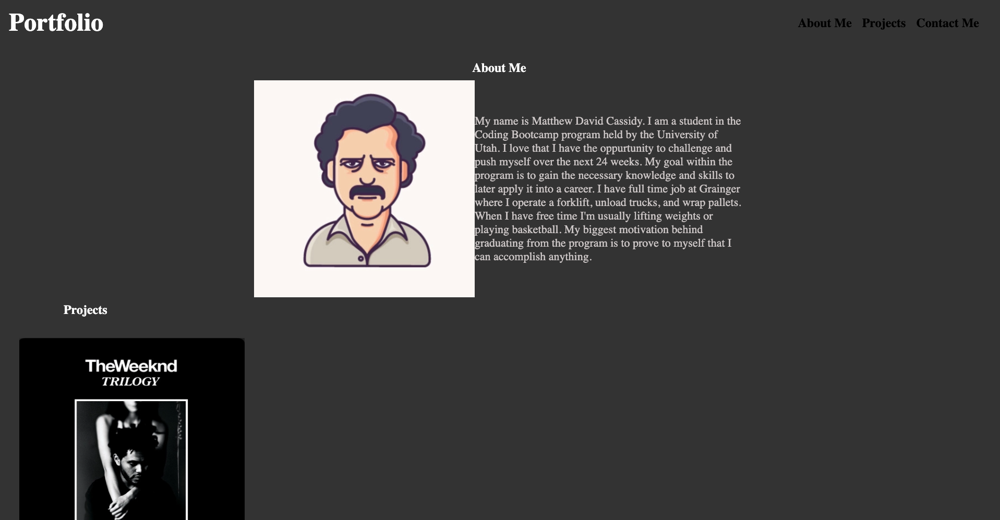
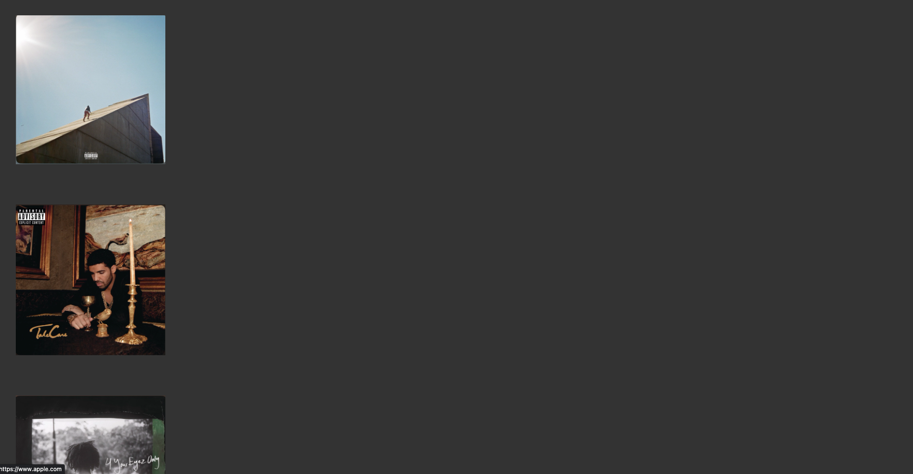
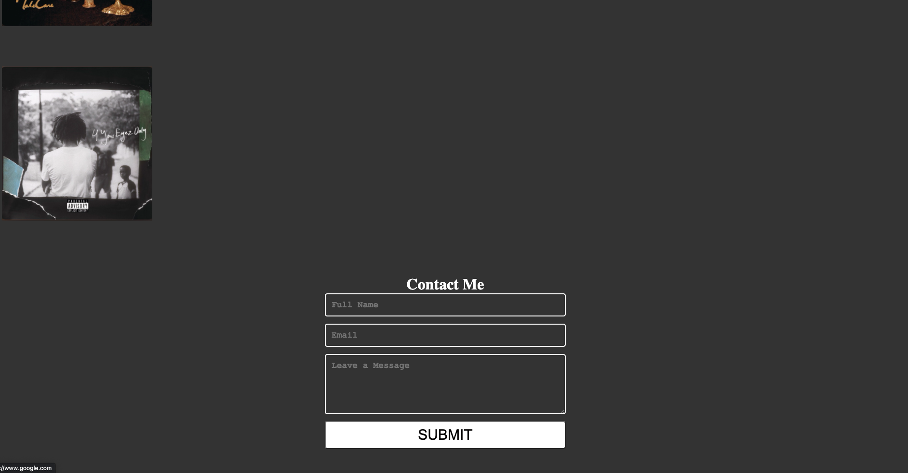

# CSS-Portfolio-Challenge-1

## Description ##
I created a portfolio website from scratch. I used semantic html elements in an organized way. I put a header, section, article, and footer. At the top of the website in the header section you will "Portfolio" on the left side teliing you what my website is. On the right side you will see "About Me, Projects, and Contact Me", where you can hover and click on to where you want to navigate to inside the website. Then there is the section with an avatar representing me and a paragraph about me. In the next part of the website, you will see my projects. You can click on them to lead you to the applications. Finally, at the bottom of the website you will find a contact form so that the viewer can leave a message. I styled the website with CSS where I also commented what my CSS code is targeting and its function. 

## Screenshot ##

## Code Source ##
https://codepen.io/ZachSaucier/pen/jOwNvO
(Used contact form code, but changed and edited it into my own unique contact form.)

https://www.w3schools.com/css/css_font.asp
(Used to get font code)

https://www.w3schools.com/css/css3_flexbox_container.asp
(Helped me with flex box code for CSS)

# Link to Deployed Application ##
https://mateocassidy.github.io/CSS-Portfolio-Challenge/
